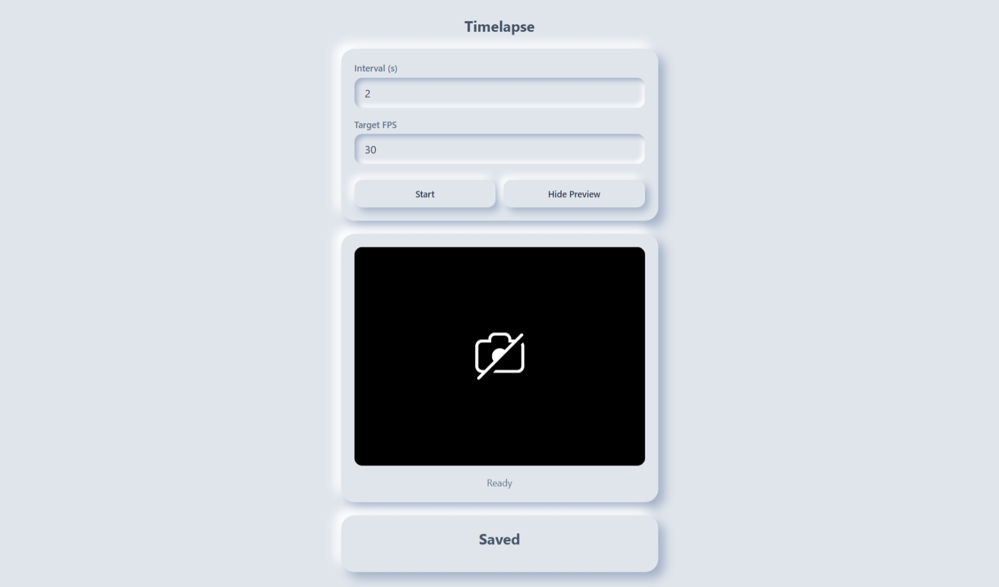

# Hello World!
This is MIRARI a tool to help record super long videos in timelapse. This is a short side project I hope to use personally and potentially help others too. Everything in this project stays completely in your laptop. This means **COMPLETE PRIVACY**!!!

## Features:

- Fully customisable timelapse options. You can choose at what intervals should the tool capture frames, the target fps too. there will also be a feature to choose the desired output resolution in the future
- The recorded videos stays in your browser's localstorage so no leaking out data anywhere. Complete privacy!

## There are a lot of things i will be using it for you can too!!

- I need these timelapse videos of my long study sessions for social media and i am a bit skeptical about privacy when i record on other online timelapse platforms, so i created my own ( kind of gives me this aura: I want something so i make it on my own!!!!!!!!!)
- Create a record of my day
- And many more!!!

demo link: https://abhrajit-gogoi.github.io/mirari/

### Hope you enjoy this tool i made! thank you!!!!!

